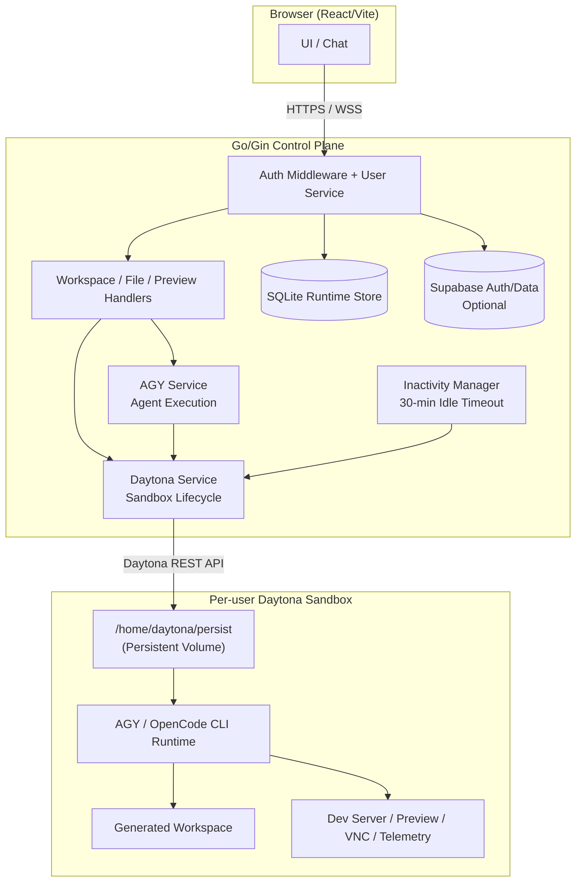

# DELTA

Autonomous multi-agent cloud IDE. A user types a natural-language prompt in a browser-based split-screen UI, and AI agents running inside isolated cloud sandboxes generate, edit, and run code in real time with a live preview.

## Architecture



## Tech Stack

| Layer | Technology |
|---|---|
| Frontend | React 19, TypeScript, Vite 8, Tailwind CSS 3, Radix UI, Monaco Editor |
| Backend | Go 1.25, Gin, Gorilla WebSocket, golang-jwt, pure-Go SQLite |
| Agent Layer | Python (orchestrator + 4 specialized agent personas) |
| Sandbox | Daytona cloud micro-VMs with persistent volumes |
| Persistence | SQLite (local runtime) + Supabase/PostgreSQL (optional cloud) |

## Quickstart

### Prerequisites

- Node.js 18+
- Go 1.25+
- Python 3.10+ (for agent layer)
- A Daytona API key ([daytona.io](https://daytona.io))

### Frontend

```bash
cd frontend
npm install
npm run dev        # Vite dev server on http://localhost:5173
npm run build      # Production build to frontend/dist/
npm run lint       # Oxlint
```

### Backend

```bash
cd backend
go run .           # Gin server on http://localhost:8080
```

Environment variables:

| Variable | Default | Description |
|---|---|---|
| `PORT` | `8080` | Backend listen port |
| `SQLITE_DB_PATH` | `data/agy_cloud.db` | SQLite database path |

Frontend environment (set in `.env` or `localStorage`):

| Variable | Description |
|---|---|
| `VITE_API_URL` | Backend base URL (default `http://localhost:8080`) |
| `VITE_SUPABASE_URL` | Supabase project URL (optional) |
| `VITE_SUPABASE_ANON_KEY` | Supabase anonymous key (optional) |

## Project Structure

```
.
├── frontend/                  # React/Vite SPA
│   └── src/
│       ├── App.tsx            # Root component, view state machine
│       ├── components/
│       │   ├── auth/          # Sign in / sign up
│       │   ├── marketing/     # Public landing page + docs
│       │   ├── onboarding/    # First-time setup wizard
│       │   ├── workspace/     # Chat, preview, files, settings
│       │   └── ui/            # Reusable primitives (shadcn/ui pattern)
│       └── config/            # API URLs, Supabase client
├── backend/                   # Go/Gin control plane
│   ├── main.go                # Server entry, route registration
│   ├── handlers/              # HTTP route handlers
│   ├── services/              # Business logic (Daytona, AGY, users)
│   ├── db/                    # SQLite init + migrations
│   └── models/                # DTOs and request/response structs
├── agents/                    # Python multi-agent orchestration
│   ├── orchestrator.py        # Central dispatch to agent personas
│   ├── drivers.py             # CLI driver abstraction (AGY, OpenCode, Claude)
│   ├── app_developer.py       # Requirements, architecture, code generation
│   ├── llm_deployer.py        # Model deployment recommendations
│   ├── app_deployer.py        # Containerization and cloud deployment
│   └── app_maintainer.py      # Repo maintenance and PR workflow
├── supabase/
│   └── schema.sql             # Cloud schema (4 tables + RLS policies)
└── docs/
    └── imagegeneration.md     # Image generation prompts for docs visuals
```

## Frontend Views

The app has four navigation states managed by `App.tsx`:

1. **Marketing** -- Public landing page with interactive architecture docs
2. **Auth** -- Sign in / sign up
3. **Setup** -- First-time onboarding (Daytona API key + Google Auth)
4. **Workspace** -- 30/70 split-screen: chat pane (left) + preview/editor (right)

## Agent System

The Python `agents/` package provides four specialized personas routed through `AgentOrchestrator`:

| Agent | Focus |
|---|---|
| AppDeveloper | Requirements interview, architecture planning, code generation |
| LLMDeployer | Traffic profiling, model deployment (RunPod, Azure AI, etc.) |
| AppDeployer | Containerization and cloud deployment |
| AppMaintainer | Repository ingestion, branch management, PR workflow |

All agents share a `CodingCliDriver` interface with three implementations: AGY (primary), OpenCode, and Claude Code (future-ready).

The web UI currently uses the Go backend's AGY/OpenCode execution path (`backend/services/agy.go`), not the Python orchestrator directly.

## Persistence

- **SQLite** (`backend/data/agy_cloud.db`): 7 tables for users, sandboxes, chat messages, agent runs, secrets, and environment config. Used as the primary runtime store.
- **Supabase** (optional): 4 cloud tables (`profiles`, `chat_messages`, `user_sandboxes`, `cloud_secrets`) with row-level security enforcing `auth.uid() = user_id`.
- **Daytona Volumes**: Per-user persistent volume mounted at `/home/daytona/persist` in each sandbox. Stores workspace files and CLI credentials.

## WebSocket Events

The backend broadcasts real-time events over `GET /ws`:

| Event | Description |
|---|---|
| `thought` | Agent reasoning step |
| `tool_start` | Tool invocation beginning |
| `token` | Streaming text from agent |
| `port_detected` | Dev server port bound (triggers preview update) |
| `error` | Agent execution error |
| `done` | Execution complete |

## Documentation

- [System Design](./system_design.md) -- Architecture, API reference, security model
- [Development Guide](./DEVELOPMENT.md) -- Local dev, data model, checklists

## License

Proprietary
