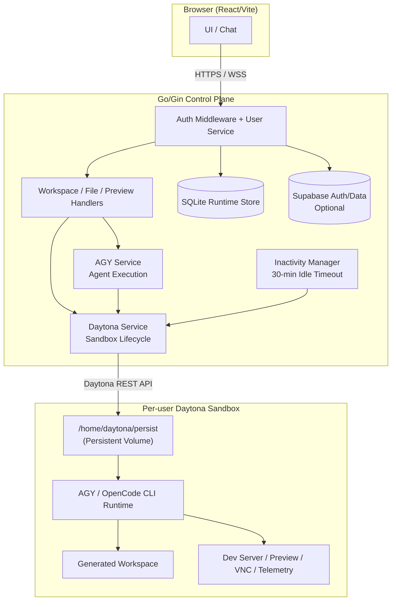

# DELTA

Autonomous multi-agent cloud IDE. A user types a natural-language prompt in a browser-based split-screen UI, and AI agents running inside isolated cloud sandboxes generate, edit, and run code in real time with a live preview.

> **Note**: This project is **source-available** for viewing purposes only and is **not open source**. All rights are reserved by the copyright holder. See the [LICENSE](LICENSE) file for complete licensing terms and contact details.

## Architecture



## Tech Stack

| Layer | Technology |
|---|---|
| Frontend | React 19, TypeScript, Vite 8, Tailwind CSS 3, Radix UI, Monaco Editor, Lucide Icons |
| Backend | Go 1.25, Gin, Gorilla WebSocket, golang-jwt, pure-Go SQLite (`modernc.org/sqlite`) |
| Multi-Project | Project-scoped persistent volumes (`/persist/projects/<slug>`) + Multi-Chat Threading |
| Sandboxes | Daytona Cloud micro-VMs with persistent volume attachments |
| Persistence | SQLite (local runtime) + Supabase/PostgreSQL (cloud option with RLS) |
| Binaries | Linux 64-bit ELF binary + Windows standalone `server.exe` (zero CGO/DLL dependencies) |

## Quickstart

### Prerequisites

- Node.js 18+
- Go 1.25+ (or run the standalone `backend/server.exe` directly on Windows)
- A Daytona API key ([daytona.io](https://daytona.io))

### Running the Backend

#### On Linux / macOS / WSL:
```bash
cd backend
go run .           # Gin server on http://localhost:8080
# Or run pre-built binary:
./server
```

#### On Windows (Native Standalone):
```powershell
cd backend
.\server.exe       # Pre-compiled pure-Go executable on http://localhost:8080
```

Environment variables:

| Variable | Default | Description |
|---|---|---|
| `PORT` | `8080` | Backend listen port |
| `SQLITE_DB_PATH` | `data/agy_cloud.db` | SQLite database path |
| `ALLOWED_ORIGINS` | `http://localhost:5173,...` | Comma-separated CORS allowed origins |
| `GOOGLE_OAUTH_CLIENT_ID` | (optional) | Gemini / Google OAuth Client ID |
| `GOOGLE_OAUTH_REDIRECT_URI`| (optional) | OAuth callback endpoint |

### Running the Frontend

```bash
cd frontend
npm install
npm run dev        # Vite dev server on http://localhost:5173
npm run build      # Production build to frontend/dist/
npm run lint       # Oxlint
```

## Project Structure

```
.
├── frontend/                  # React/Vite SPA
│   └── src/
│       ├── App.tsx            # Root component, view state machine, resizable split pane
│       ├── types/             # Project, Conversation, and Chat TypeScript interfaces
│       ├── components/
│       │   ├── auth/          # Sign in / sign up modal
│       │   ├── marketing/     # Public landing page + interactive architecture docs
│       │   ├── onboarding/    # First-time setup wizard
│       │   ├── workspace/     # Chat, preview, files, projects sidebar, settings
│       │   │   ├── ProjectsSidebar.tsx # Multi-project & multi-chat collapsible sidebar
│       │   │   ├── HeaderBar.tsx       # Top navigation, project pill, sidebar toggle
│       │   │   ├── ChatPane.tsx        # Conversation chat, engine toggle, agent modes
│       │   │   └── PreviewPane.tsx     # Live iframe, code editor, terminal tabs
│       │   └── ui/            # Reusable primitives (shadcn/ui pattern)
│       └── config/            # API URLs, Supabase client
├── backend/                   # Go/Gin control plane
│   ├── main.go                # Server entry, route registration
│   ├── handlers/              # HTTP route handlers (projects, workspace, auth, secrets)
│   │   ├── projects.go        # Multi-project and multi-chat CRUD endpoints
│   │   ├── workspace.go       # Daytona prompt dispatch, file tree, proxy
│   │   └── chat_history.go    # Threaded conversation chat history
│   ├── services/              # Business logic (Daytona, AGY, UserService)
│   ├── db/                    # SQLite init + 9-table schema migrations
│   ├── models/                # DTOs and request/response structs
│   └── server.exe             # Standalone pre-compiled Windows executable
├── supabase/
│   └── schema.sql             # Cloud schema (6 tables + RLS policies + indexes)
└── docs/
    └── imagegeneration.md     # Image generation prompts for docs visuals
```

## Multi-Project & Multi-Chat Architecture

DELTA incorporates project-level workspace isolation and conversation threading modeled after **ChatGPT Codex / Cursor Projects**:

1. **Multi-Projects**:
   - Users can create and switch between projects.
   - Each project is automatically mapped to an isolated persistent folder in the Daytona sandbox at `/home/daytona/persist/projects/<slug>/`.
   - All agent prompts and file edits are executed relative to the active project folder.

2. **Multi-Chats (Conversation Threading)**:
   - Multiple chat threads can be created within each project.
   - Chats can be searched, renamed inline, and deleted.
   - Chat history is persisted per conversation in SQLite and Supabase with foreign-key integrity.

3. **Collapsible Sidebar**:
   - Toggleable via the top-left icon in the `HeaderBar`.
   - Offers project switching, quick "+ New Project", "+ New Chat", and conversation search.

4. **Adjustable Split Pane Workspace**:
   - Drag-to-resize divider with double-click reset to 32% and persistent `localStorage` memory.
   - Active drag overlay prevents Monaco and iframe embeds from swallowing mouse events.

## Persistence

- **SQLite** (`backend/data/agy_cloud.db`): 9 tables for users, projects, conversations, sandboxes, chat messages, user environments, agent runs, agent messages, and cloud secrets.
- **Supabase** (optional): 6 cloud tables (`profiles`, `projects`, `conversations`, `chat_messages`, `user_sandboxes`, `cloud_secrets`) with row-level security enforcing `auth.uid() = user_id`.
- **Daytona Volumes**: Per-user persistent volume mounted at `/home/daytona/persist` in each sandbox.

## Documentation

- [System Design](./system_design.md) -- Comprehensive architecture, API endpoints, data models
- [Development Guide](./DEVELOPMENT.md) -- Local dev workflow, cross-compilation, deployment

## License

Proprietary
