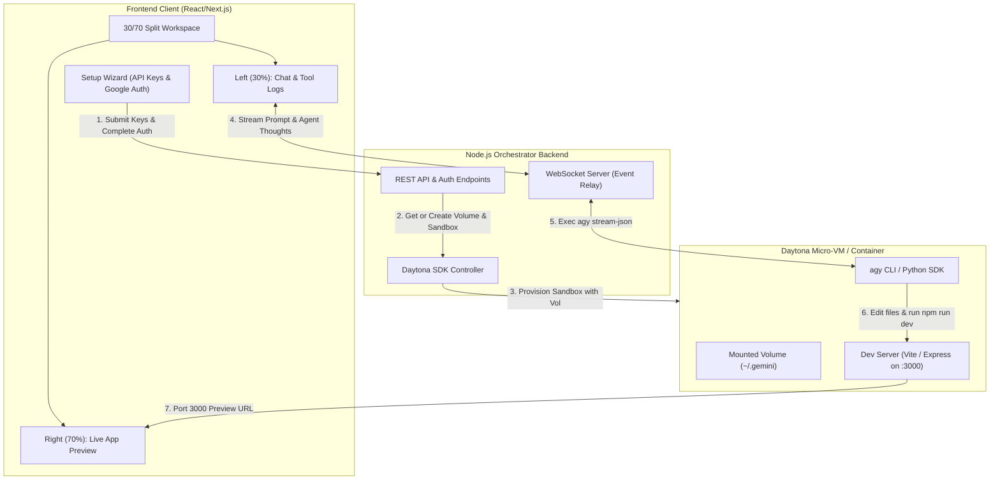
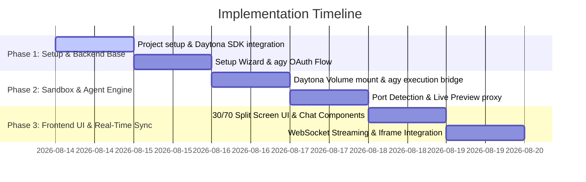

# Implementation Plan: AGY Cloud Agent Workspace with Daytona & Google Auth

A cloud-based AI coding workspace (similar to Codex Cloud / Devin) using **Antigravity CLI (`agy`)** in headless/SDK mode for AI code generation with your personal **Google Account AI quota**, executing inside isolated **Daytona Sandboxes**, controlled by a custom **30/70 split-screen Web UI**.

---

## 1. Executive Summary & Tech Stack

### Core Objectives
1. **Bring Your Own Quota (BYOQ)**: Authenticate `agy` CLI once via Google OAuth and persist the credentials in a per-user **Daytona Volume** (`~/.gemini`).
2. **Per-User Sandbox Isolation**: Dynamically provision isolated Daytona containers per session.
3. **Live App Preview**: Run code generated by `agy` directly inside Daytona and embed the live preview on the frontend using Daytona's port proxying.
4. **Clean Split-Screen UI**: 
   - **Left Pane (30%)**: Chat interface showing agent reasoning, stream tokens, file diffs, and tool calls.
   - **Right Pane (70%)**: Interactive live iframe preview of the running web app (with fallback to code editor & sandbox terminal tabs).

### Recommended Tech Stack
* **Frontend**: Next.js (App Router), React, Tailwind CSS, Lucide Icons, `xterm.js` (terminal preview), `monaco-editor` / diff view.
* **Backend Orchestrator**: Node.js (TypeScript) + Express / Fastify, `@daytonaio/sdk`, WebSockets (`ws`) / Server-Sent Events (SSE).
* **Sandbox Environment**: Daytona Cloud Sandbox running Docker container pre-installed with `agy` CLI, Node.js, Python, Git, and `pip install google-antigravity`.
* **State & Persistence**: Daytona Volumes (`/root/.gemini` per user) + local SQLite/JSON session store.

---

## 2. Architecture & Data Flow



---

## 3. Detailed Subsystem Specifications

### Phase 1: First-Time Setup Wizard (Onboarding Flow)

The application will feature a clean modal/page setup wizard on initial load:

1. **Step 1: Daytona API Key Verification**
   * Input field for `DAYTONA_API_KEY` and optional `DAYTONA_SERVER_URL`.
   * Backend verifies access via `@daytonaio/sdk` (`daytona.profile.get()`).
2. **Step 2: Google Account OAuth (`agy auth`)**
   * Backend spins up a lightweight onboarding Daytona sandbox mounting the user's dedicated volume (`user-<id>-auth-vol`) to `/root/.gemini`.
   * Backend executes `agy auth` (or runs Python setup script) to initiate Google OAuth.
   * Backend parses stdout/JSON for the Google login URL & verification code.
   * Frontend displays a prominent "Connect Google Account" card with:
     - Direct Google OAuth link.
     - Device verification code.
     - Real-time polling indicator: `Waiting for authentication...`
   * Once user completes Google authorization in their browser, `agy` writes refresh tokens to `/root/.gemini`.
   * Setup completes, and credentials are saved to the persistent volume.

---

### Phase 2: Per-User Sandbox & Volume Lifecycle

```typescript
// Proposed Server-Side Daytona Provisioning Logic
import { Daytona } from "@daytonaio/sdk";

export async function getOrCreateUserWorkspace(userId: string, repoUrl?: string) {
  const daytona = new Daytona({ apiKey: process.env.DAYTONA_API_KEY });
  const volumeName = `vol-user-auth-${userId}`;
  
  // 1. Ensure persistent credential volume exists
  const volume = await daytona.volume.getOrCreate(volumeName);

  // 2. Create isolated container with mounted auth volume
  const sandbox = await daytona.create({
    labels: { userId },
    volumes: [
      {
        volumeId: volume.id,
        mountPath: "/root/.gemini" // agy automatically reads cached auth
      }
    ],
    image: "registry.yourdomain.com/agy-daytona-runner:latest"
  });

  // 3. Clone optional initial repository
  if (repoUrl) {
    await sandbox.process.exec(`git clone ${repoUrl} /workspace`);
  }

  return sandbox;
}
```

---

### Phase 3: Real-Time Streaming & WebSocket Bridge

`agy` execution events inside Daytona are streamed back to the frontend using JSON-RPC / SSE over WebSockets:

* **Event Payload Schema**:
  ```json
  {
    "type": "thought" | "tool_start" | "tool_end" | "token" | "port_detected" | "error",
    "content": "Editing src/App.tsx...",
    "metadata": {
      "tool": "replace_file_content",
      "path": "src/App.tsx",
      "port": 3000
    }
  }
  ```

---

### Phase 4: Live Preview & Port Proxying

1. When `agy` executes shell commands like `npm run dev` or `vite` inside Daytona:
   * The backend monitors active network sockets inside the sandbox.
   * As soon as a dev server binds to a port (e.g. `3000`, `5173`, `8000`), Daytona generates a public or proxy preview URL (`https://<sandbox_id>-3000.daytona.app`).
2. The backend sends a `port_detected` event to the frontend.
3. The Right Pane iframe automatically reloads to point to the active preview URL.

---

### Phase 5: 30/70 Split UI & Component Hierarchy

```
frontend/
├── components/
│   ├── onboarding/
│   │   ├── SetupWizard.tsx         # Daytona API Key & Google Auth Modal
│   │   └── GoogleAuthCard.tsx      # OAuth Link & Verification Code Renderer
│   ├── workspace/
│   │   ├── SplitLayout.tsx         # Resizable 30% / 70% Pane Container
│   │   ├── ChatPane.tsx            # Left 30%: Message list, thoughts, tool execution badges
│   │   ├── PromptInput.tsx         # Chat textarea with send & stop buttons
│   │   ├── PreviewPane.tsx         # Right 70%: Tabbed Live Iframe, Monaco Code Diff, Terminal
│   │   └── HeaderBar.tsx           # Status indicators (Sandbox state, Google Auth badge, Port selector)
```

---

## 4. Execution & Development Plan



---

## 5. Verification & Testing Strategy

1. **Auth Verification**: Verify that completing Google OAuth in the Setup Wizard successfully writes auth files into the Daytona Volume, and a newly created sandbox can run `agy -p "hi"` without asking for auth.
2. **Agent Execution**: Verify that sending a prompt to `agy` inside Daytona creates/edits files in `/workspace`.
3. **Live Preview Verification**: Verify that running `npm run dev` inside Daytona updates the Right Pane iframe with the live running React/Vite app.

---

## 6. Next Steps & Approval Request

> [!IMPORTANT]
> Please review this implementation plan. Once approved, we will begin building the codebase in the workspace.
