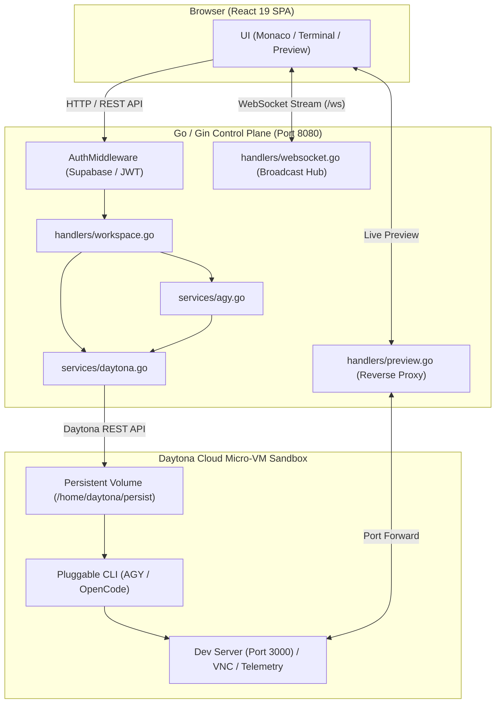
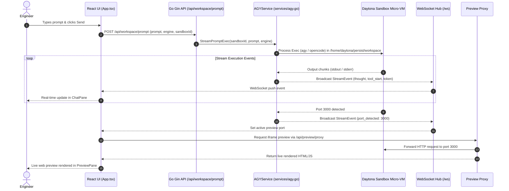
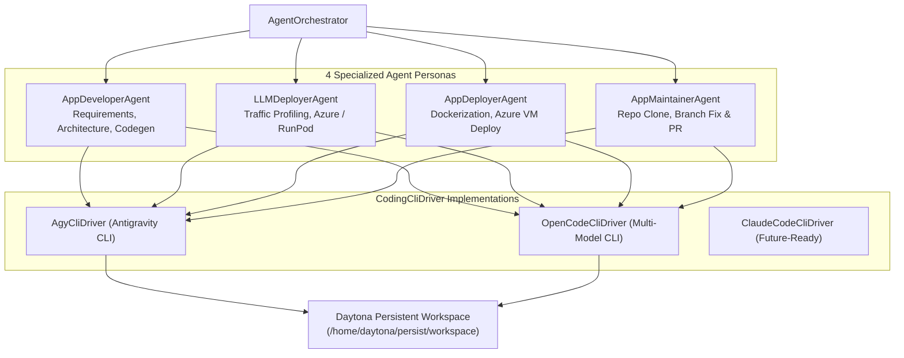
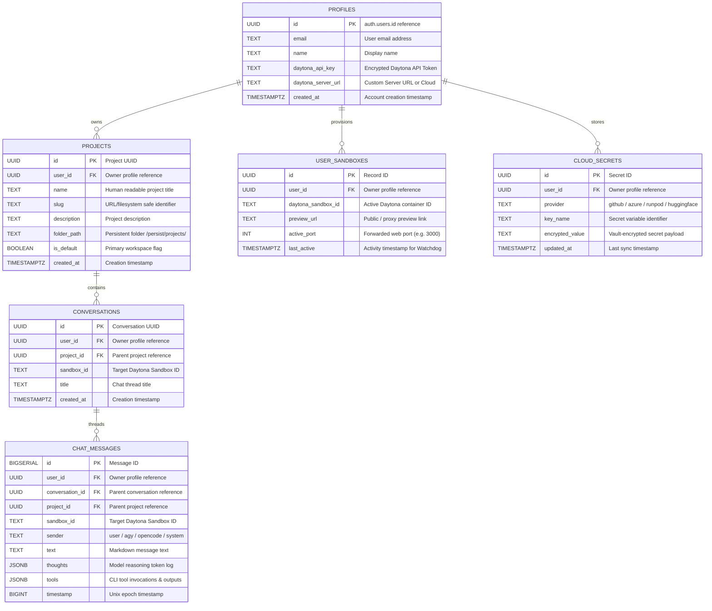

# DELTA System Design

This document describes the implemented architecture of DELTA. It references executable code and registered routes, not speculative plans.

## 1. Request Path Overview

A user request flows through three layers:



## 2. Frontend

### 2.1 View State Machine

`frontend/src/App.tsx` manages four views:

| View | Component | Description |
|---|---|---|
| `marketing` | `LandingPage.tsx` | Public landing page with interactive architecture docs |
| `auth` | `AuthView.tsx` | Sign in / sign up (Supabase & local fallback) |
| `setup` | `SetupWizard.tsx` | First-time onboarding (Daytona key + Google Auth) |
| `workspace` | Split layout | 30/70 chat + preview workspace |

Session state is restored from `localStorage` on load: `daytona_api_key`, `daytona_server_url`, `daytona_user_id`, `user_email`, `user_name`, `auth_token`, `daytona_sandbox_id`. When an auth token exists, the app calls `GET /api/auth/me` to restore the user profile and active sandbox.

A persistent WebSocket connects to `GET /ws` and reconnects after a 3-second delay on close.

### 2.2 Workspace Components

| Component | File | Responsibility |
|---|---|---|
| `HeaderBar` | `components/workspace/HeaderBar.tsx` | Sandbox status, engine switcher, user profile |
| `ChatPane` | `components/workspace/ChatPane.tsx` | Prompt input, agent messages, thought/tool rendering, AGY/OpenCode selector |
| `FileTree` | `components/workspace/FileTree.tsx` | Workspace file navigation |
| `PreviewPane` | `components/workspace/PreviewPane.tsx` | Live iframe preview, code editor, terminal tabs |
| `SettingsModal` | `components/workspace/SettingsModal.tsx` | Credentials, integrations, preferences |
| `TelemetryView` | `components/workspace/TelemetryView.tsx` | Runtime CPU, memory, network metrics |

### 2.3 Configuration

- `config/api.ts` -- derives REST base URL from `VITE_API_URL` and WebSocket URL from it
- `config/supabase.ts` -- creates Supabase client from Vite env vars or `localStorage` fallback

## 3. Backend Control Plane

### 3.1 Initialization

`backend/main.go` starts in this order:

1. Resolve `PORT` (default `8080`) and `SQLITE_DB_PATH` (default `data/agy_cloud.db`)
2. Initialize SQLite via `db.InitDB` (WAL mode, connection pooling, 7-table schema migration)
3. Create Gin router with CORS rules
4. Construct services: `DaytonaService`, `AGYService`, `UserService`, `SupabaseService`
5. Start WebSocket hub goroutine
6. Start `InactivityManager` with 30-minute threshold
7. Register `/api/*` routes with `AuthMiddleware` + activity recording middleware
8. Register `/ws` WebSocket endpoint
9. Listen on `:<PORT>`

### 3.2 Authentication

`handlers/auth.go` implements a hybrid model:

1. Extracts `Authorization: Bearer <token>` header (fallback: `?token=` query param)
2. If Supabase is configured, verifies token via Supabase Auth
3. Otherwise validates JWT locally through `UserService`
4. Populates `userId`, email, name, and Daytona config in Gin context

### 3.3 Daytona Service

`services/daytona.go` talks to the Daytona Cloud API:

- `CreateSandbox`: creates an isolated micro-VM sandbox with volume mount
- `ExecuteCommand`: runs commands inside the sandbox (sync or streaming)
- `ListFiles` / `GetFileContent` / `SaveFileContent`: workspace file operations
- `SaveSecret`: saves credentials to Daytona Secrets Manager

### 3.4 AGY & OpenCode Service

`services/agy.go` drives agent execution:

- **Bootstrap**: installs/configures CLI tools in sandbox, initializes Gemini credentials
- **Execution**: `StreamPromptExec` supports two engines selected by the UI:
  - `agy` -- AGY command runner with `--output-format stream-json`
  - `opencode` -- OpenCode command runner
- Both operate on the persistent workspace path `/home/daytona/persist/workspace`
- Output is parsed into structured `StreamEvent` values and broadcast via WebSocket

### 3.5 WebSocket Hub & Request Lifecycle

`handlers/websocket.go` implements a Gorilla WebSocket broadcast hub. `GET /ws` upgrades browser connections. The frontend `App.tsx` handles these event types:

| Event | Frontend Behavior |
|---|---|
| `thought` | Appended to last agent message's thought list |
| `tool_start` | Renders a tool invocation card |
| `token` | Appends text to agent response |
| `port_detected` | Updates active preview URL and port |
| `error` | Marks current agent message as failed |
| `done` | Stops processing indicator |



## 4. Agent Layer & CLI Switcher

The Python package under `agents/` is a modular orchestration layer independent of the Go backend's execution path.

### 4.1 Architecture



The orchestrator accepts `agent_mode`, `prompt`, `sandbox_id`, `api_key`, repository info, traffic profile, and server URL. It resolves the requested persona and delegates through the shared driver contract.

## 5. Persistence & Database Schema



### 5.1 SQLite (Local Runtime)

`backend/db/db.go` initializes the local database with 9 tables: `users`, `projects`, `conversations`, `sandboxes`, `chat_messages`, `user_environments`, `agent_runs`, `agent_messages`, and `cloud_secrets`.

### 5.2 Supabase (Cloud Persistence)

`supabase/schema.sql` defines 6 tables with row-level security: `profiles`, `projects`, `conversations`, `chat_messages`, `user_sandboxes`, and `cloud_secrets`. All tables enforce `auth.uid() = user_id` ownership via RLS policies.

## 6. Workspace Lifecycle

### Provisioning

`POST /api/env/provision` and `POST /api/workspace/create` both call `CreateWorkspace`:

1. Check for a usable Daytona API key
2. List existing sandboxes; return a usable one if found
3. Ensure a per-user volume named `vol-<userId>`
4. Create sandbox with volume mounted at `/home/daytona/persist`
5. Persist the active sandbox record via `UserService`

### Multi-Project Persistent Folders

When a project is created, a dedicated persistent directory is allocated inside the user's volume:
```bash
/home/daytona/persist/projects/<slug>/
```
Agent executions (`POST /api/workspace/prompt`) change directory into the active project folder before invoking `agy` or `opencode`.

### Idle Management

A 30-minute `InactivityManager` runs at backend startup. Activity middleware records sandbox activity on each API request. The manager stops idle sandboxes automatically.

## 7. API Reference Summary

### Auth

| Method | Path | Implementation |
|---|---|---|
| POST | `/api/auth/register` | `handlers.Register` |
| POST | `/api/auth/signup` | alias of register |
| POST | `/api/auth/login` | `handlers.Login` |
| POST | `/api/auth/logout` | lightweight success response |
| GET | `/api/auth/me` | user/profile + active sandbox |
| POST | `/api/auth/settings` | update user Daytona settings |
| GET | `/api/auth/google/callback` | Google/AGY callback integration |

### Multi-Projects

| Method | Path | Purpose |
|---|---|---|
| GET | `/api/projects` | List all projects for authenticated user |
| POST | `/api/projects` | Create new project with persistent folder mount |
| PUT | `/api/projects/:id` | Update project name or description |
| DELETE | `/api/projects/:id` | Cascade delete project and associated chats |

### Multi-Chats (Conversations)

| Method | Path | Purpose |
|---|---|---|
| GET | `/api/conversations` | List conversation threads (`?projectId=...`) |
| POST | `/api/conversations` | Create new conversation under project |
| PUT | `/api/conversations/:id` | Rename conversation title |
| DELETE | `/api/conversations/:id` | Delete conversation and messages |
| GET | `/api/chat/history` | Fetch messages (`?conversationId=...`) |
| POST | `/api/chat/history` | Save message with conversation context |
| DELETE | `/api/chat/history` | Clear messages (`?conversationId=...`) |

### Workspace & Execution

| Method | Path | Purpose |
|---|---|---|
| POST | `/api/workspace/create` | Create workspace with volume |
| GET | `/api/workspace/status/:sandboxId` | Check micro-VM status |
| GET | `/api/workspace/files` | List files (`?folder=...`) |
| GET | `/api/workspace/file-content` | Read file |
| POST | `/api/workspace/file-save` | Save file |
| POST | `/api/workspace/prompt` | Run AGY or OpenCode prompt with project context |
| POST | `/api/workspace/stop` | Stop running prompt |
| GET | `/api/workspace/preview-url` | Fetch live preview URL |
| ANY | `/api/preview/proxy/:sandboxId/:port/*path` | Reverse proxy to dev server |
| GET | `/ws` | Real-time WebSocket event stream |
