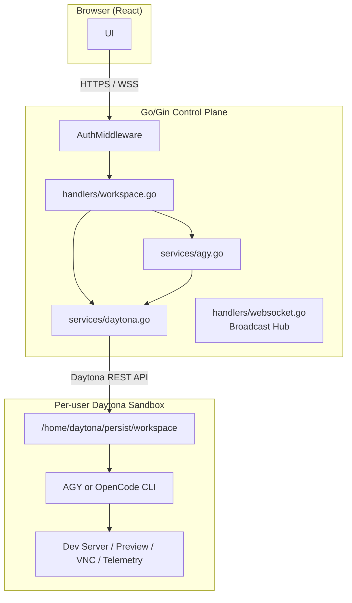
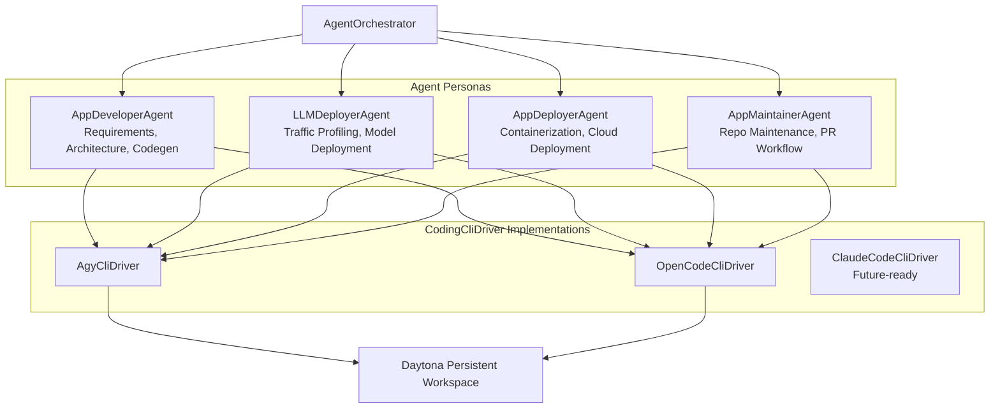

# DELTA System Design

This document describes the implemented architecture of DELTA. It references executable code and registered routes, not speculative plans.

## 1. Request Path Overview

A user request flows through three layers:

## 2. Frontend

### 2.1 View State Machine

`frontend/src/App.tsx` manages four views:

| View | Component | Description |
|---|---|---|
| `marketing` | `LandingPage.tsx` | Public landing page with interactive architecture docs |
| `auth` | `AuthView.tsx` | Sign in / sign up |
| `setup` | `SetupWizard.tsx` | First-time onboarding (Daytona key + Google Auth) |
| `workspace` | Split layout | 30/70 chat + preview workspace |

Session state is restored from `localStorage` on load: `daytona_api_key`, `daytona_server_url`, `daytona_user_id`, `user_email`, `user_name`, `auth_token`, `daytona_sandbox_id`. When an auth token exists, the app calls `GET /api/auth/me` to restore the user profile and active sandbox.

A persistent WebSocket connects to `GET /ws` and reconnects after a 3-second delay on close.

### 2.2 Workspace Components

| Component | File | Responsibility |
|---|---|---|
| `HeaderBar` | `components/workspace/HeaderBar.tsx` | Sandbox status, controls |
| `ChatPane` | `components/workspace/ChatPane.tsx` | Prompt input, agent messages, thought/tool rendering, AGY/OpenCode selector |
| `FileTree` | `components/workspace/FileTree.tsx` | Workspace file navigation |
| `PreviewPane` | `components/workspace/PreviewPane.tsx` | Live iframe preview, code editor, terminal tabs |
| `SettingsModal` | `components/workspace/SettingsModal.tsx` | Credentials, integrations, preferences |
| `TelemetryView` | `components/workspace/TelemetryView.tsx` | Runtime metrics |

### 2.3 Configuration

- `config/api.ts` -- derives REST base URL from `VITE_API_URL` and WebSocket URL from it
- `config/supabase.ts` -- creates Supabase client from Vite env vars or `localStorage` fallback

## 3. Backend Control Plane

### 3.1 Initialization

`backend/main.go` starts in this order:

1. Resolve `PORT` (default `8080`) and `SQLITE_DB_PATH` (default `data/agy_cloud.db`)
2. Initialize SQLite via `db.InitDB` (WAL mode, connection pooling, 7-table schema migration)
3. Create Gin router with permissive CORS
4. Construct services: `DaytonaService`, `AGYService`, `UserService`, `SupabaseService`
5. Start WebSocket hub goroutine
6. Start `InactivityManager` with 30-minute threshold
7. Register `/api/*` routes with `AuthMiddleware` + activity recording middleware
8. Register `/ws` WebSocket endpoint
9. Listen on `:<PORT>`

### 3.2 Authentication

`handlers/auth.go` implements a hybrid model:

1. Extracts `Authorization: Bearer <token>` header (fallback: `?token=` query param)
2. If Supabase is configured, verifies token via Supabase
3. Otherwise validates JWT locally through `UserService`
4. Populates `userId`, email, name, and Daytona config in Gin context

**Current gap**: the middleware does not reject all unauthenticated requests. Several handlers accept user/sandbox IDs from client-supplied parameters. This is an MVP-level implementation that requires hardening before production multi-tenancy.

### 3.3 Daytona Service

`services/daytona.go` is an HTTP client wrapper around the Daytona REST API:

| Capability | Details |
|---|---|
| API key verification | Validates credentials against Daytona profile endpoint |
| Volume management | Lookup/create with deterministic `vol-<userId>` naming |
| Sandbox lifecycle | Create, list, stop, delete; 30-min auto-stop interval |
| Persistent storage | Volume mounted at `/home/daytona/persist` |
| Command execution | Process exec inside sandbox |
| File operations | List, read, write, mkdir, delete via sandbox filesystem |
| Preview | URL generation and HTTP proxy to sandbox ports |
| VNC | Start/stop/status delegation to Daytona |
| Telemetry | Sandbox metrics retrieval |

### 3.4 AGY Service

`services/agy.go` handles sandbox bootstrap and agent execution:

- **Bootstrap**: installs/configures CLI tools in sandbox, initializes Gemini credentials
- **Execution**: `StreamPromptExec` supports two engines selected by the UI:
  - `agy` -- AGY command runner with `--output-format stream-json`
  - `opencode` -- OpenCode command runner
- Both operate on the persistent workspace path `/home/daytona/persist/workspace`
- Output is parsed into structured `StreamEvent` values and broadcast via WebSocket

### 3.5 WebSocket Hub

`handlers/websocket.go` implements a Gorilla WebSocket broadcast hub. `GET /ws` upgrades browser connections. The frontend `App.tsx` handles these event types:

| Event | Frontend Behavior |
|---|---|
| `thought` | Appended to last agent message's thought list |
| `tool_start` | Renders a tool invocation card |
| `token` | Appends text to agent response |
| `port_detected` | Updates active preview URL and port |
| `error` | Marks current agent message as failed |
| `done` | Stops processing indicator |

## 4. Agent Layer

The Python package under `agents/` is a modular orchestration layer independent of the Go backend's execution path.

### 4.1 Architecture

The orchestrator accepts `agent_mode`, `prompt`, `sandbox_id`, `api_key`, repository info, traffic profile, and server URL. It resolves the requested persona and delegates through the shared driver contract.

**Important**: the web UI does not call the Python orchestrator. `backend/services/agy.go` is the production execution path. The Python layer is available as a library for programmatic or future integration use.

## 5. Persistence

### 5.1 SQLite (Runtime)

`backend/db/db.go` initializes the local database with 7 tables:

| Table | Purpose |
|---|---|
| `users` | User accounts and Daytona configuration |
| `sandboxes` | Active sandbox records per user |
| `chat_messages` | Persisted chat/tool/thought payloads |
| `user_environments` | Environment variable storage |
| `agent_runs` | Agent execution history |
| `agent_messages` | Individual agent message records |
| `cloud_secrets` | Integration secret records |

### 5.2 Supabase (Optional Cloud)

`supabase/schema.sql` defines 4 tables with row-level security:

| Table | Purpose |
|---|---|
| `profiles` | User profile and Daytona configuration |
| `chat_messages` | Persisted chat payloads |
| `user_sandboxes` | Sandbox identity and preview state |
| `cloud_secrets` | Provider/key-name secret records |

All tables enforce `auth.uid() = user_id` ownership via RLS policies.

## 6. Workspace Lifecycle

### Provisioning

`POST /api/env/provision` and `POST /api/workspace/create` both call `CreateWorkspace`:

1. Check for a usable Daytona API key
2. List existing sandboxes; return a usable one if found
3. Ensure a per-user volume named `vol-<userId>`
4. Create sandbox with volume mounted at `/home/daytona/persist`
5. Fall back to alternate create payloads if first attempt fails
6. Persist the active sandbox record via `UserService`

### Idle Management

A 30-minute `InactivityManager` runs at backend startup. Activity middleware records sandbox activity on each API request. The manager stops idle sandboxes automatically.

### File Operations

The backend proxies file list/read/write/mkdir/delete through the Daytona service. Both `/api/workspace/*` and `/api/fs/*` endpoints map to the same underlying operations.

### Preview

The backend exposes:
- `GET /api/workspace/preview-url` and `GET /api/preview/url` -- preview link generation
- `ANY /api/preview/proxy/:sandboxId/:port/*path` -- HTTP proxy to sandbox port

The frontend listens for `port_detected` WebSocket events and updates the preview iframe accordingly.

## 7. API Reference

### Health

| Method | Path | Handler |
|---|---|---|
| GET | `/api/health` | `HealthCheck` |

### Authentication

| Method | Path | Handler |
|---|---|---|
| POST | `/api/auth/register` | `Register` |
| POST | `/api/auth/signup` | `Register` (alias) |
| POST | `/api/auth/login` | `Login` |
| POST | `/api/auth/logout` | lightweight success |
| GET | `/api/auth/me` | `GetMe` |
| POST | `/api/auth/settings` | `UpdateSettings` |
| GET | `/api/auth/google/callback` | `GoogleOAuthCallback` |

### Chat History

| Method | Path | Handler |
|---|---|---|
| GET | `/api/chat/history` | `GetChatHistoryHandler` |
| POST | `/api/chat/history` | `SaveChatMessageHandler` |
| DELETE | `/api/chat/history` | `ClearChatHistoryHandler` |
| GET | `/api/runs` | `ListRunsHandler` |

### Setup and Environment

| Method | Path | Handler |
|---|---|---|
| POST | `/api/env/provision` | `CreateWorkspace` |
| GET | `/api/env/status` | static response |
| POST | `/api/env/auth/start` | `InitGoogleAuth` |
| GET | `/api/env/auth/poll` | static response |
| POST | `/api/setup/verify-daytona` | `VerifyDaytonaKey` |
| POST | `/api/setup/init-google-auth` | `InitGoogleAuth` |
| POST | `/api/setup/submit-auth-code` | `SubmitAuthCode` |
| POST | `/api/setup/save-google-key` | `SaveGoogleApiKeyHandler` |
| GET | `/api/setup/auth-status/:userId` | `CheckGoogleAuthStatus` |

### Workspace and Files

| Method | Path | Handler |
|---|---|---|
| POST | `/api/workspace/create` | `CreateWorkspace` |
| GET | `/api/workspace/status/:sandboxId` | `GetWorkspaceStatus` |
| GET | `/api/workspace/files` | `ListWorkspaceFiles` |
| GET | `/api/workspace/file-content` | `GetFileContent` |
| POST | `/api/workspace/file-save` | `SaveFileContent` |
| POST | `/api/workspace/prompt` | `SendPrompt` |
| POST | `/api/workspace/stop` | `StopPrompt` |
| GET | `/api/workspace/logs` | `FetchSandboxLogs` |
| POST | `/api/workspace/reset` | `ResetApp` |
| GET | `/api/workspace/env` | `GetEnvVars` |
| POST | `/api/workspace/env` | `SaveEnvVars` |
| POST | `/api/workspace/recreate` | `RecreateWorkspace` |
| GET | `/api/workspace/preview-url` | `GetPreviewLinkHandler` |
| POST | `/api/workspace/vnc/start` | `StartVNCHandler` |
| POST | `/api/workspace/vnc/stop` | `StopVNCHandler` |
| GET | `/api/workspace/vnc/status` | `GetVNCStatusHandler` |
| GET | `/api/workspace/telemetry` | `GetTelemetryHandler` |

### File System Aliases

| Method | Path | Handler |
|---|---|---|
| GET | `/api/fs/list` | `ListWorkspaceFiles` |
| GET | `/api/fs/read` | `GetFileContent` |
| PUT | `/api/fs/write` | `SaveFileContent` |
| POST | `/api/fs/mkdir` | `CreateFolderHandler` |
| DELETE | `/api/fs/delete` | `DeleteFileHandler` |

### Preview, VNC, Telemetry

| Method | Path | Handler |
|---|---|---|
| GET | `/api/preview/url` | `GetPreviewLinkHandler` |
| ANY | `/api/preview/proxy/:sandboxId/:port/*path` | `PreviewProxyHandler` |
| POST | `/api/vnc/start` | `StartVNCHandler` |
| GET | `/api/telemetry/metrics` | `GetTelemetryHandler` |

### Integrations and Webhooks

| Method | Path | Handler |
|---|---|---|
| GET | `/api/integrations/secrets` | `GetSecretsStatusHandler` |
| POST | `/api/integrations/secrets` | `SaveSecretsHandler` |
| POST | `/api/webhooks/daytona` | `DaytonaWebhookHandler` |

### WebSocket

| Method | Path | Handler |
|---|---|---|
| GET | `/ws` | `HandleWebSocket` |

## 8. Security Assessment

**Strong boundaries:**
- Agent execution runs in Daytona sandboxes, not on the host
- Request middleware populates user context when tokens are accepted
- Supabase schema enforces per-user RLS policies

**Production gaps (must fix before multi-tenant deployment):**
- CORS allows all origins (`*`)
- WebSocket origin checks return `true` unconditionally
- Auth middleware allows unauthenticated requests to continue
- Client-supplied user/sandbox IDs are accepted by multiple endpoints
- Daytona credentials are persisted in user configuration paths with no defined key-management lifecycle
- Integration secrets API exists but encryption/key rotation is not implemented

## 9. Source-of-Truth Hierarchy

When documentation and code disagree:

1. Executable code
2. Route registration in `backend/main.go`
3. Schema in `supabase/schema.sql`
4. Frontend components and config
5. Planning documents (historical intent only)
